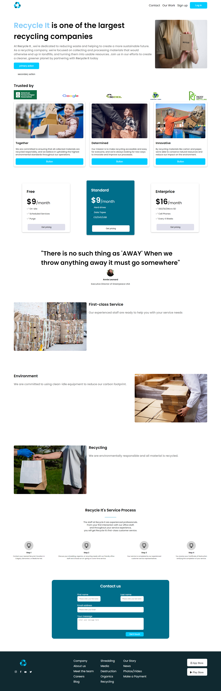

# CODE-Challenge



## Description

<p>This is CODE-Challenge that describes a recyclying company which is dedicated to reducing waste and helping to create a more sustainable future. By recycling materials like carton and paper, they are able to conserve natural resources and reduce our impact on the environment. Join us in our efforts to create a cleaner, greener planet by partnering with Recycle It today

## 🖥️ Live Demo

[The CODE-Challenge](https://elhamatokhi.github.io/CODE-Challenge/)

## Built With

HTML
CSS
JS

### Setup

1. Download the **Zip** file or clone the repo with:

```bash
git clone https://github.com/elhamatokhi/CODE-Challenge.git
```

3. To access cloned directory run:

```bash
cd CODE-Challenge
```

3. Open it with the live server

### Install

> To install linters and other project's dependencies run:

```bash
npm install
```

## Run Test for Linters

For tracking linter errors locally you need to follow these steps:

1. For tracking linter errors in HTML files run:

```bash
npx hint .
```

2. For tracking linter errors in CSS or SASS files run:

```bash
npx stylelint "\*_/_.{css,scss}"
```

3. For tracking linter errors in JavaScript files run:

```bash
npx eslint .
```

## Authors

👤 **Author1**

- GitHub:[@elhamatokhi](https://github.com/elhamatokhi)
- 
## 🤝 Contributing

Contributions, issues, and feature requests are welcome!

## Show your support

Give a ⭐️ if you like this project!

## Acknowledgments

- Thanks to everyone who will get time to check this code and suggest any [issue](https://github.com/elhamatokhi/CODE-Challenge/issues) to improve the page.

## 📝 License

This project is [MIT](./MIT.md) licensed.
